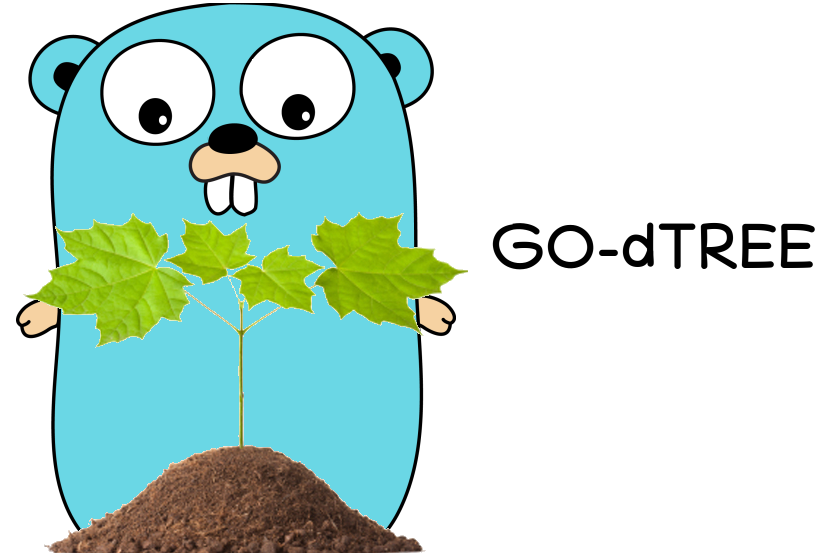
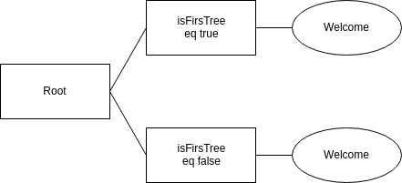

## GO-DTREE - Golang package for resolve decisions Tree

DTree allow you to define an Decision Tree in json

```json
{
				"id": 1,
				"name": "isFirstTree"
			},
			{
				"id": 2,
				"name": "Welcome",
				"parent_id": 1,
				"operator": "eq",
				"value": true
			},
			{
				"id": 3,
				"name": "Congrats",
				"parent_id": 1,
				"operator": "eq",
				"value": false
			}

```

loaded 

```golang
  tree, err :=dtree.LoadTree([]byte(jsonTree))
```

it will create :



the error is only for json errors.

If you want to programmaticaly build your tree, you can also use the CreateTree Method.

```golang
var myTree []Tree
// append your nodes on myTree and then
tree :=dtree.LoadTree([]byte(jsonTree))
```

Then we can resolve the decision Tree by passing another json, representing the needed value.  

```golang
    request := []byte(`{
		"isFirstTree":     true
	}`)

    node, _ := t.ResolveJSON(request)

    fmt.Println(node.Name)
    // Output: Welcome
```

you can also define it programmatically,

```golang
    request := make(map[string]interface{}) 
    request["isFirstTree"] = true

    node, _ := t.Resolve(request)

    fmt.Println(node.Name)
    // Output: Welcome
```

but in this case be careful, to don't use int (not supported), only floats.

This one was a simple decision Tree. You can build more complexe with more nodes, with others operators than only equal.

## Available Operators :
|operator|description|
|---|---|s
|eq (or ==)| equality (for string, bool, numbers, arrays) |
|ne (or !=)| not equal (for string, bool, numbers, arrays) |
|gt (or >)| gt (for string, numbers) |
|lt (or <)| lt (for string, numbers) |
|gte (or >=)| gte (for string, numbers) |
|lte (or <=)| lte (for string, numbers) |
|contains| does the string (defined on the value of the Tree) is contained on the json request |
|count|  count (only for arrays) |
|regexp| do a regecp (only for string) |

You can also define your own operators 

## Custom operators 

You can define your own custom operators (on the example I do a len of an array pass on request, and i check if it matches the Value of the path of the node on the Tree (it is the code of the already implemented operator "count"))

```golang
f := func(t *TreeOptions) {
    t.Operators = make(map[string]func(v1 interface{}, v2 *dtree.Tree) (bool, error))
    t.Operators["len"] = func(v1 interface{}, v2 *dtree.Tree) (bool, error) {
            switch t1 := v1.(type) {
            case []interface{}:
                if t2, ok := v2.Value.(float64); ok {
                    if len(t1) == int(t2) {
                        return v2, nil
                    }
                    return nil, nil
                }

                return nil, dtree.ErrBadType
            default:
                return nil, dtree.ErrNotSupportedType
            }
        }
    }
}
```
Of course if you have really good operators that you want to add to DTREE, does not hesitate to do a PR.

## Options :

By default if dtree cannot resolve one node (because bad parameters), we consider this node as false, and it continues.
We can set the option StopIfConvertingError at true, on this case dtree will stop once it found an parsing error.

```golang
f := func(t *TreeOptions) {
    t.StopIfConvertingError = true
}
```

We can also define a fallback value. It means on this case, that if all others path are in false, it go to this one.

```json
"value": "fallback"
```

We can also set an order, to define the order of the evaluation (but of course fallback will always be the last (even if you don't say so))

```json
"order": "1"
```


